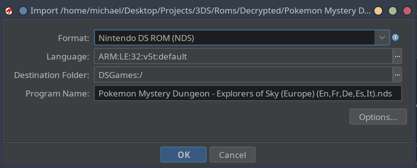
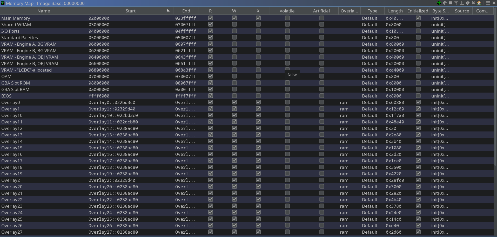
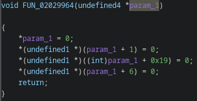
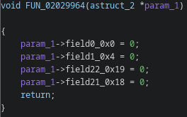
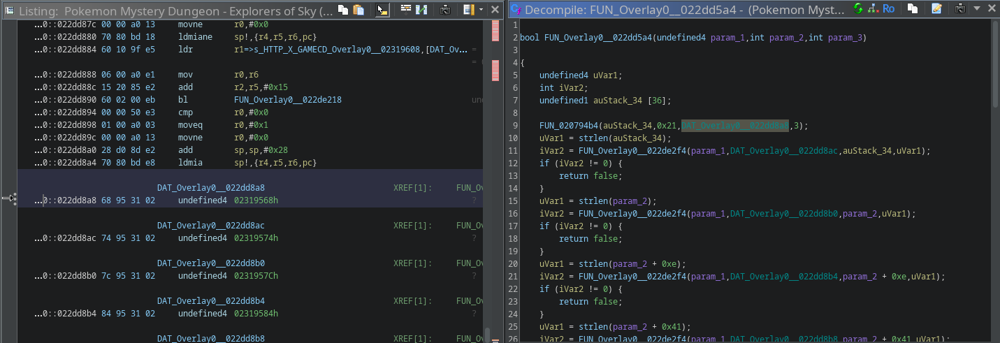
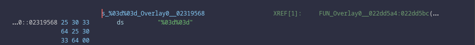
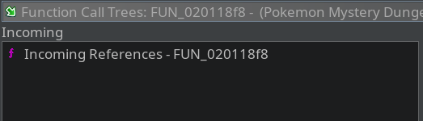
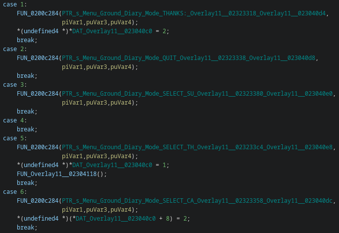
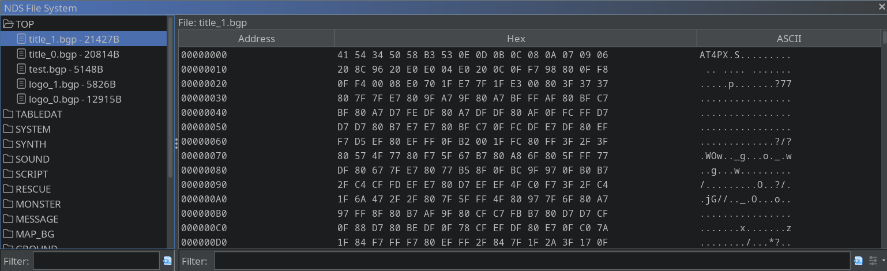

# Documenting the reverse-engineering process for *Pokemon Mystery Dungeon: Explorers of Sky*

## Introduction

In this project, I will attempt reverse-engineer one of my favourite childhood DS games: *Pokémon Mystery Dungeon: Explorers of Sky* and document the process. The reverse-engineering process will primarily focus on static analysis of the ARM9 binary using the tool Ghidra. I'm also using my custom Ghidra extension, [Ndsware](https://github.com/CodeDragon82/nds-ware), to load the main ARM9 code and overlay sections into Ghidra.

A big reason for choosing to reverse-engineer *Pokémon Mystery Dungeon: Explorers of Sky* rather than some other DS games, is because of the instruction set used. The Nintendo DS is an ARMv5T (32-bit) architecture, which supports both ARM (32-bit) and Thumb (16-bit) instructions. Many DS games switch between instruction sets for different functions. This can be difficult for reverse-engineering, because Ghidra’s decompiler often struggles to correctly identify which instruction set to use at any given time. Fortunately, *Pokémon Mystery Dungeon: Explorers of Sky* uses only the ARM instruction set, which makes Ghidra’s auto-analysis and decompilation significantly more reliable.

Due to legal reasons, I will not provide the `.nds` ROM for this game, nor do I encourage pirating the game. If you own a legitimate copy, there are many tutorials online that explain how to extract the ROM yourself. This documentation will not cover the extraction process.

I'm aware that others have already reverse-engineered and documented various aspects of this game. However, the goal of this documentation is to walk the reader through the process of reverse-engineering a game like this. This documentation will also highlight challenges and discuss techniques used to overcome them.

This research is currently a work in progress, so I'll be continuously adding to it and amend mistakes as I discover new information. It's worth noting that I'm new to reversing ARM binaries and DS games, so I'm likely to make bad assumptions from time to time. If I get anything wrong please feel free to reach out (via GitHub Issues) and let me know.

## Prerequisite Knowledge

To ensure that this documentation doesn't require a book worth of notes, I will be assumed that you have the following prerequisite knowledge:

- A decent understanding of how to use Ghidra.
- Familiarity with C consepts such as structs, enums, functions, pointers, global variables/constants, etc.
- The ability to read and understand C code.
- Knowledge of common low-level vulnerabilities such as buffer overflows, format string vulnerabilities, etc.
- A general understanding of assembly instructions.
- An understanding of memory regions, specially within embedded systems.

## Setup

When we import the `.nds` file into Ghidra, the `Ndsware` Ghidra extension recognises it as an NDS ROM and selects the necessary language.



Upon clicking "OK", the `Ndsware` loader, extracts the ARM9 code and overlay sections from the `.nds` file, and inserts them into memory at the correct base addresses. The loader also defines the other uninitialised regions of the memory map.



Before running the auto analysis, we should decompile and mark the entry function at `0x2000800`. We should also rename the function as `entry`, so that the auto analysis identifies it as the entry.

## Challenges

Before delving into the analysis of this binary, we should first lay out some of the challenges that we will need to overcome.

### Challenge 1 - No Symbols

Firstly, the binary is stripped, which means we don't have symbols, including function or global variable names. As a result, we need to make educated guesses about the roles of each function by analysing how data is operated on and by examining references to defined strings for contextual clues.

### Challenge 2 - No Struct Definitions

Secondly, the binary is missing structure definitions, so we need to identify and reconstruct these structs manually. If there's a variable in a function that is referenced with offset values, then it's likely that the variable is a struct. For example, in the function below we can see that `param_1` is dereferenced with offsets. This is generally a clear indication that `param_1` is likely a struct and the offsets are fields with that struct.



We can utilise Ghidra's "Auto Create Structure" option (when right-clicking on the variable) to automatically create/reconstruct parts of the struct definition.



We can also work out the true size of a struct by looking for functions that appear to initial the struct. In some cases, there maybe calls to functions like `memset` and `malloc` to initial the struct memory, and the `size` parameter of these calls can tell us size of the struct.

### Challenge 3 - Indirect References

Thirdly, as we'll see later on, there are lots of global variables/constants that are referenced indirectly. In other words, functions dereference global pointers that point to other global variables/constants. This is especially difficult when dealing with defined strings. Functions never reference the define string directly, but instead reference a global pointer that points to the defined string. These global pointers are typed as `undefined4 *` instead of `char *` which means that the decompiled code doesn't recognise the defined string. To fix this issue we have to manually find these global pointers and retype them to `char *`. This is obviously going to be very time-consuming. 

In the example below, we can see that the function references a global variable of type `undefined4`.



However, the global variable is actual a pointer to a defined (global) string, so we need to retype it to `char *`.



### Challenge 4 - Indirect Function Calls

Finally, in some cases, functions are referenced through global pointers and these functions are called by dereferencing the global pointer. Once again this can make it difficult to identify function calls if the global pointers are not typed correctly, and most cases they're not. Also, if these global variables are not typed as pointers, the function being called will have missing incoming references, as shown in the example below.



*It should be noted that this is all guess work and there's no perfect way to obtain the original symbols and struct definitions.*

## Identifying Standard (Nitro SDK) Functions

Before continuing, it's important to explain what we mean by standard functions in the context of Nintendo DS games. In typically C-based binaries, standard functions refer to functions that are implemented in `libc` such as `memset`, `memcpy`, `strcpy`, `strcmp`, `printf`, `puts`, `gets`, etc. However, Nitendo DS games instead use a custom set of standard functions defined in the [Nitro SDK](https://twlsdk.randommeaninglesscharacters.com/docs/nitro/NitroSDK/index.html). The Nitro SDK contains custom implementations of the many of these `libc` functions. For example, instead of `memset` and `memcpy`, the SDK contains [`MI_CpuFill`](https://twlsdk.randommeaninglesscharacters.com/docs/nitro/NitroSDK/mi/memory/MI_CpuFill.html) and [`MI_CpuCopy`](https://twlsdk.randommeaninglesscharacters.com/docs/nitro/NitroSDK/mi/memory/MI_CpuCopy.html). It also contains functions for handling 2D/3D graphics, interacting with the operating system, accessing game files stored on the ROM, and many other aspects of the Nintendo DS.

As discussed in the [challenges](#challenges) section, the binary doesn't include symbols, so we can't immediately see standard functions. Identifying these functions is vital because they provide valuable context on how data is being used in more complex functions. Therefore, it's important to identify as many standard functions as possible before reversing-engineering larger systems within the game. 

To identify standard memory functions (e.g., `MI_CpuCopy`), we're looking for function that appear to have very basic behaviour such as moving memory between variables and/or performing basic comparisons. Ideally, these functions should NOT call other functions or reference global variables/constants. A good way to find these standard functions is to pick a random function and follow the function call tree until we reach the end. Also, since these standard functions are essentially the basic building blocks of most other functions within the game, we would expect them to be called many times throughout the binary. Therefore, another good indicator is if the function has many references.

In the Nitro SDK, there is a set of ["STD" functions](https://twlsdk.randommeaninglesscharacters.com/docs/nitro/NitroSDK/std/list_std.html) for handling strings. Many of these functions appear to be custom implementations of the `str` functions in `libc`. For example, instead of `srcpy`, `strstr`, and `strcmp`, SDK has [`STD_CopyString`](`https://twlsdk.randommeaninglesscharacters.com/docs/nitro/NitroSDK/std/string/STD_CopyString.html), [`STD_SearchString`](https://twlsdk.randommeaninglesscharacters.com/docs/nitro/NitroSDK/std/string/STD_SearchString.html), and [`STD_CompareString`](https://twlsdk.randommeaninglesscharacters.com/docs/nitro/NitroSDK/std/string/STD_CompareString.html). The best way to find these functions is to look at the defined string in the binaries and search through the references. We're looking for function calls where a defined string is passed in as an argument.

Once we find one standard function, we should search for other functions in the same area memory because functions from the same library will appear next to each other. For example, when I found `STD_CompareNString` at `0x02089cd8`, I looked above it in the listing and found `STD_ConcatenateString` at `0x02089b44`.

Identifying standard functions can be very useful because we can use them workout the size of variables, structs, or struct fields. For example, in the function below there is a call to [MI_CpuClear](https://twlsdk.randommeaninglesscharacters.com/docs/nitro/NitroSDK/mi/memory/MI_CpuClear.html). `MI_CpuClear` takes 2 arguments: A `pointer` to some data, and the `size` of the data. It then sets all bytes in that data to zero. In this call to `MI_CpuClear`, the `size` parameter is 12, so we now know the size of `field_0x10` in `astruct_45` is 12 bytes.

```c
void FUN_0201b33c(astruct_45 *param_1)

{
    param_1->field64_0x40 = 0;
    FUN_0200b67c(&param_1->field_0x20);
    if (param_1->field28_0x1c == '\0') {
        return;
    }
    MI_CpuClear(&param_1->field_0x10,0xc);
    param_1->field28_0x1c = '\0';
    return;
}
```

These small clues scattered in different functions across the program can help us reconstruct definitions of structs. We can find all calls to `MI_CpuClear` and modified struct definitions as we go. This can be done for other similar functions like `MI_CpuFill` and `MI_CpuCopy`.

## Identifying a Debug Logging Function

Many of the defined strings appear to be logging/debugging messages for system events, such as `"sound resume\n"` and `"card backup error\n"`. Some messages are more specific to game events, such as `"MainGame enter dungeon mode %d %d\n"`. These strings are consistently referenced by a function at `0x0200c284`, which is called from various locations across the binary. In each case, the function receives a pointer in its first argument to one of these strings. This pattern strongly suggests that the function handles logging within the program.

```c
void FUN_0200c284(undefined4 param_1,undefined4 param_2,undefined4 param_3,undefined4 param_4)
{
    undefined1 auStack_118 [256];
    undefined4 local_18;
    undefined4 local_10;
    undefined4 uStack_c;
    undefined4 uStack_8;
    undefined4 uStack_4;
    
    local_18 = param_4;
    local_10 = param_1;
    uStack_c = param_2;
    uStack_8 = param_3;
    uStack_4 = param_4;
    FUN_020898dc(auStack_118,param_1,&uStack_c);
    return;
}
```

Identifying the function that handles logging messages is a vital step in reversing binary, because it can help us workout the roles of other functions. For example, in `FUN_Overlay11__02303f5c` there are several calls to log message about the selected option in a menu. Therefore, it's safe to assume that this function handles user input for a menu in the game.



## Game Files

As well as the game code, the NDS ROM also has a file system. This file system contains many files with game data, including sounds, graphics (such as textures, sprites, colour palettes), character states, item information, etc. Understanding the game files and what they contain is a key part of reverse-engineering the game. In version 1.1.0 of [Ndsware](https://github.com/CodeDragon82/nds-ware), the Ghidra extension has an option under the "Nds" toolbar menu to "Show Files". This shows all files and folders contained in the NDS ROM, along with the file data.



In this section, we will aim to identify key files in game, understand their data format, what they contain, how they are used in the binary, and what function use them.

Reading game files can be challenging because many of them use custom or proprietary file formats. If a file includes magic bytes at the beginning, we can search for those bytes online to find documentation or articles describing the format. For example, in the screenshot above, `title_1.bgp` starts with the magic bytes `AT4PX`, which is a compressed image format from Nintendo. If a file doesn't contain magic bytes, we may need to manually reverse-engineer the format by analysing patterns such as length fields, strings, and other byte patterns. Tools like [Kaitai](https://kaitai.io/) can be used to define the structure of a format once it's been worked out. Fortunately, someone else has already done the hard work and documented the file formats in the *Pokemon Mystery Dungeon* games: https://projectpokemon.org/home/docs/mystery-dungeon-nds/at4px-file-format-r40/

For the purpose of this documentation I will not will explaining each of the file formats. One, this would take far to long, and two, the person who wrote the article has done a very good job at already explaining the format of these files. "We stand on the shoulders of giants". However, I will build on this person's research by developing scripts to parse out the data from these custom files. For this, I'll use Kaitai to define file formats and then use the Kaitai compiler to generate Python parsers.
